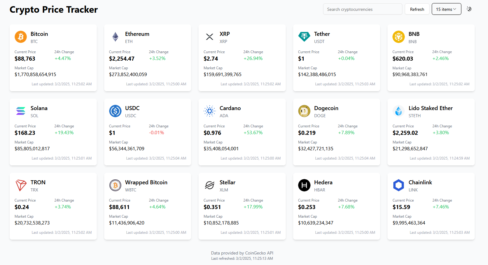

# CryptoPrice

A real-time cryptocurrency price tracking application with an intuitive dashboard for monitoring and analyzing cryptocurrency markets.

<div align="center">
  <a href="https://crypto-price-lyart.vercel.app/" target="_blank">
    
  </a>
  <a href="https://suchithh.github.io/CryptoPrice/" target="_blank">
    
  </a>
  <a href="https://github.com/suchithh/CryptoPrice" target="_blank">
    
  </a>
</div>

## Dashboard



## Features

-   **Real-Time Price Tracking** - Monitor cryptocurrency prices with automatic 60-second updates
-   **Detailed Information** - View comprehensive data including price changes, market cap, and historical trends
-   **Responsive Design** - Optimized for both desktop and mobile experiences
-   **Search Functionality** - Quickly find specific cryptocurrencies
-   **Dark/Light Mode** - Toggle between themes based on preference
-   **Customizable Display** - Choose how many cryptocurrencies to display at once

## Live Demo

Check out the live application: [CryptoPrice on Vercel](https://crypto-price-lyart.vercel.app/)

## Getting Started

### Prerequisites

-   Node.js
-   npm or yarn
-   Git

### Installation

1.  Clone the repository:

    ```bash
    git clone https://github.com/suchithh/CryptoPrice.git
    ```
2.  Navigate to the project directory:

    ```bash
    cd CryptoPrice
    ```
3.  Install dependencies for the web application:

    ```bash
    cd web-app
    npm install
    ```
4.  Run the development server:

    ```bash
    npm run dev
    ```
5.  Open `http://localhost:3000` in your browser to view the application. (Alternatively, use the IP address and port number displayed in the terminal to access the application on other devices)

## Documentation

Full documentation is available at [https://suchithh.github.io/CryptoPrice/](https://suchithh.github.io/CryptoPrice/)

### Running the Documentation Locally

1.  Navigate to the `docs` directory:

    ```bash
    cd docs
    ```
2.  Install documentation dependencies:

    ```bash
    npm install
    ```
3.  Start the Docusaurus development server:

    ```bash
    npx docusaurus start
    ```
4.  Open `http://localhost:3000` to view the documentation.

## Technology Stack

-   **Frontend**: Next.js, React
-   **Styling**: Tailwind CSS, shadcn/UI
-   **State Management**: Zustand
-   **Data Fetching**: Axios
-   **API**: CoinGecko
-   **Documentation**: Docusaurus

## Project Structure

```
CryptoPrice/
├── web-app/                # Next.js application
│   ├── src/
│   │   ├── app/            # Application code
│   │   │   ├── components/ # UI components
│   │   │   ├── store/      # Zustand state management
│   │   │   ├── page.tsx    # Main application page
│   ├── public/             # Static assets
├── docs/                   # Documentation site (Docusaurus)
│   ├── docs/               # Documentation content
│   ├── src/                # Documentation site components
│   ├── static/             # Static assets for documentation
```

## Key Design Decisions

-   Client side filtering for responsive search experience
-   60 second polling interval to respect API rate limits
-   Caching strategy for historical data to reduce redundant API calls
-   Mobile adjusted responsive design using Tailwind's responsive utilities

## Screenshots

## Screenshots

<div align="center">
    
</div>

<div align="center" style="display: flex; justify-content: center; align-items: center; flex-wrap: wrap; gap: 10px;">
    
    
</div>

## Future Improvements

-   Portfolio tracking functionality
-   Price alerts and notifications
-   Additional historical chart options
-   WebSocket integration for real-time updates
-   Progressive Web App capabilities

## Acknowledgements

-   [CoinGecko API](https://www.coingecko.com/en/api) for cryptocurrency data
-   [Next.js](https://nextjs.org/) for the React framework
-   [Tailwind CSS](https://tailwindcss.com/) for styling
-   [shadcn/UI](https://ui.shadcn.com/) for UI components
-   [Zustand](https://github.com/pmndrs/zustand) for state management